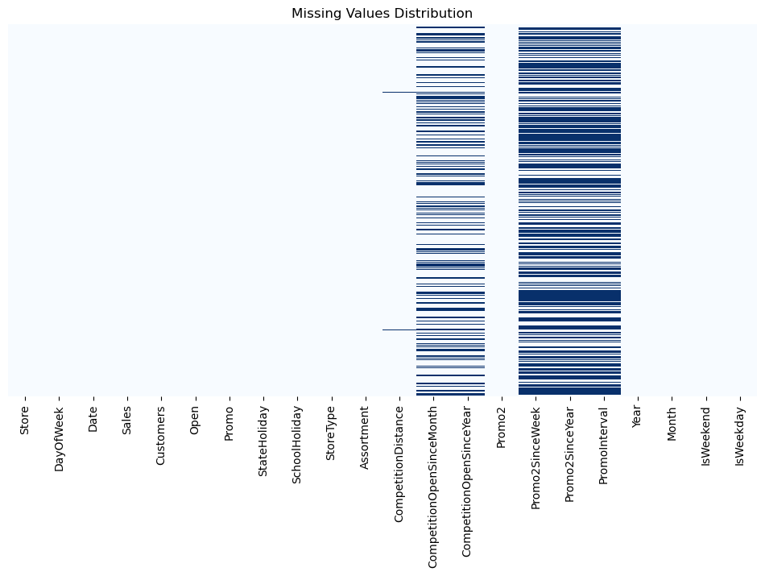
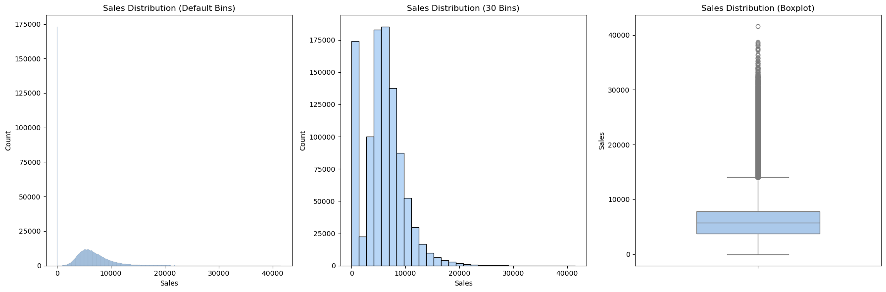
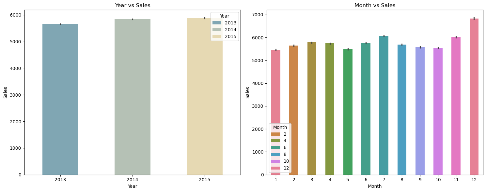
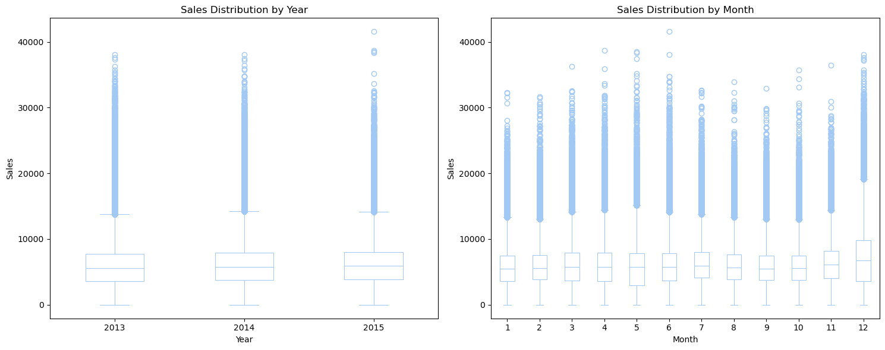
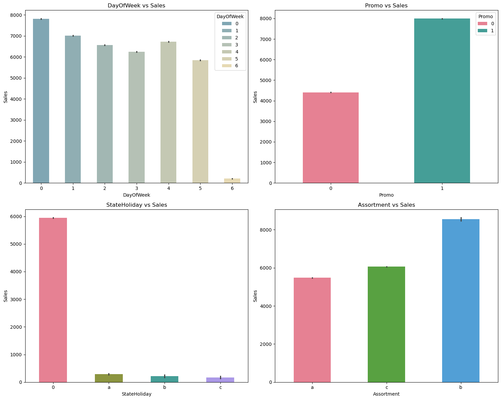
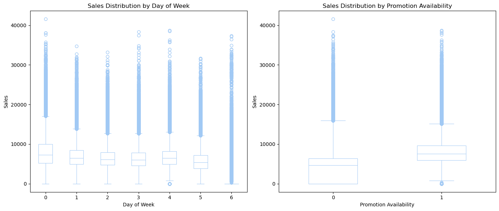

# Store Exploratory Analysis and Sales Forecast

## 1. Project Overview

### 1.1. Overview and Findings

### 1.2. Aim

### 1.3 Data

* Id - an Id that represents a (Store, Date) duple within the test set
* Store - a unique Id for each store
* Sales - the turnover for any given day (this is what you are predicting)
* Customers - the number of customers on a given day
* Open - an indicator for whether the store was open: 0 = closed, 1 = open
* StateHoliday - indicates a state holiday. Normally all stores, with few exceptions, are closed on state holidays. Note that all schools are closed on * * public holidays and weekends. a = public holiday, b = Easter holiday, c = Christmas, 0 = None
* SchoolHoliday - indicates if the (Store, Date) was affected by the closure of public schools
* StoreType - differentiates between 4 different store models: a, b, c, d
* Assortment - describes an assortment level: a = basic, b = extra, c = extended
* CompetitionDistance - distance in meters to the nearest competitor store
* CompetitionOpenSince[Month/Year] - gives the approximate year and month of the time the nearest competitor was opened
* Promo - indicates whether a store is running a promo on that day
* Promo2 - Promo2 is a continuing and consecutive promotion for some stores: 0 = store is not participating, 1 = store is participating
* Promo2Since[Year/Week] - describes the year and calendar week when the store started participating in Promo2
* PromoInterval - describes the consecutive intervals Promo2 is started, naming the months the promotion is started anew. E.g. "Feb,May,Aug,Nov" means each round starts in February, May, August, November of any given year for that store

## 2. Data Understanding


```python
# import lybriries 
import pandas as pd
import numpy as np
import seaborn as sns
import matplotlib.pyplot as plt
```

### 2.1 Load data


```python
#load store details
store_details = pd.read_csv("./Data/store.csv")
store_details.head()
```


<div>
<style scoped>
    .dataframe tbody tr th:only-of-type {
        vertical-align: middle;
    }

    .dataframe tbody tr th {
        vertical-align: top;
    }

    .dataframe thead th {
        text-align: right;
    }
</style>
<table border="1" class="dataframe">
  <thead>
    <tr style="text-align: right;">
      <th></th>
      <th>Store</th>
      <th>StoreType</th>
      <th>Assortment</th>
      <th>CompetitionDistance</th>
      <th>CompetitionOpenSinceMonth</th>
      <th>CompetitionOpenSinceYear</th>
      <th>Promo2</th>
      <th>Promo2SinceWeek</th>
      <th>Promo2SinceYear</th>
      <th>PromoInterval</th>
    </tr>
  </thead>
  <tbody>
    <tr>
      <th>0</th>
      <td>1</td>
      <td>c</td>
      <td>a</td>
      <td>1270.0</td>
      <td>9.0</td>
      <td>2008.0</td>
      <td>0</td>
      <td>NaN</td>
      <td>NaN</td>
      <td>NaN</td>
    </tr>
    <tr>
      <th>1</th>
      <td>2</td>
      <td>a</td>
      <td>a</td>
      <td>570.0</td>
      <td>11.0</td>
      <td>2007.0</td>
      <td>1</td>
      <td>13.0</td>
      <td>2010.0</td>
      <td>Jan,Apr,Jul,Oct</td>
    </tr>
    <tr>
      <th>2</th>
      <td>3</td>
      <td>a</td>
      <td>a</td>
      <td>14130.0</td>
      <td>12.0</td>
      <td>2006.0</td>
      <td>1</td>
      <td>14.0</td>
      <td>2011.0</td>
      <td>Jan,Apr,Jul,Oct</td>
    </tr>
    <tr>
      <th>3</th>
      <td>4</td>
      <td>c</td>
      <td>c</td>
      <td>620.0</td>
      <td>9.0</td>
      <td>2009.0</td>
      <td>0</td>
      <td>NaN</td>
      <td>NaN</td>
      <td>NaN</td>
    </tr>
    <tr>
      <th>4</th>
      <td>5</td>
      <td>a</td>
      <td>a</td>
      <td>29910.0</td>
      <td>4.0</td>
      <td>2015.0</td>
      <td>0</td>
      <td>NaN</td>
      <td>NaN</td>
      <td>NaN</td>
    </tr>
  </tbody>
</table>
</div>


```python
#load train data
train = pd.read_csv("./Data/train.csv")
train.head()
```

    C:\Users\Admin\AppData\Local\Temp\ipykernel_41860\1372570245.py:2: DtypeWarning: Columns (7) have mixed types. Specify dtype option on import or set low_memory=False.
      train = pd.read_csv("./Data/train.csv")
    


<div>
<style scoped>
    .dataframe tbody tr th:only-of-type {
        vertical-align: middle;
    }

    .dataframe tbody tr th {
        vertical-align: top;
    }

    .dataframe thead th {
        text-align: right;
    }
</style>
<table border="1" class="dataframe">
  <thead>
    <tr style="text-align: right;">
      <th></th>
      <th>Store</th>
      <th>DayOfWeek</th>
      <th>Date</th>
      <th>Sales</th>
      <th>Customers</th>
      <th>Open</th>
      <th>Promo</th>
      <th>StateHoliday</th>
      <th>SchoolHoliday</th>
    </tr>
  </thead>
  <tbody>
    <tr>
      <th>0</th>
      <td>1</td>
      <td>5</td>
      <td>2015-07-31</td>
      <td>5263</td>
      <td>555</td>
      <td>1</td>
      <td>1</td>
      <td>0</td>
      <td>1</td>
    </tr>
    <tr>
      <th>1</th>
      <td>2</td>
      <td>5</td>
      <td>2015-07-31</td>
      <td>6064</td>
      <td>625</td>
      <td>1</td>
      <td>1</td>
      <td>0</td>
      <td>1</td>
    </tr>
    <tr>
      <th>2</th>
      <td>3</td>
      <td>5</td>
      <td>2015-07-31</td>
      <td>8314</td>
      <td>821</td>
      <td>1</td>
      <td>1</td>
      <td>0</td>
      <td>1</td>
    </tr>
    <tr>
      <th>3</th>
      <td>4</td>
      <td>5</td>
      <td>2015-07-31</td>
      <td>13995</td>
      <td>1498</td>
      <td>1</td>
      <td>1</td>
      <td>0</td>
      <td>1</td>
    </tr>
    <tr>
      <th>4</th>
      <td>5</td>
      <td>5</td>
      <td>2015-07-31</td>
      <td>4822</td>
      <td>559</td>
      <td>1</td>
      <td>1</td>
      <td>0</td>
      <td>1</td>
    </tr>
  </tbody>
</table>
</div>


```python
# join the two datasets

combined_dataset = pd.merge(train, store_details, on ='Store')
combined_dataset.head()

```


<div>
<style scoped>
    .dataframe tbody tr th:only-of-type {
        vertical-align: middle;
    }

    .dataframe tbody tr th {
        vertical-align: top;
    }

    .dataframe thead th {
        text-align: right;
    }
</style>
<table border="1" class="dataframe">
  <thead>
    <tr style="text-align: right;">
      <th></th>
      <th>Store</th>
      <th>DayOfWeek</th>
      <th>Date</th>
      <th>Sales</th>
      <th>Customers</th>
      <th>Open</th>
      <th>Promo</th>
      <th>StateHoliday</th>
      <th>SchoolHoliday</th>
      <th>StoreType</th>
      <th>Assortment</th>
      <th>CompetitionDistance</th>
      <th>CompetitionOpenSinceMonth</th>
      <th>CompetitionOpenSinceYear</th>
      <th>Promo2</th>
      <th>Promo2SinceWeek</th>
      <th>Promo2SinceYear</th>
      <th>PromoInterval</th>
    </tr>
  </thead>
  <tbody>
    <tr>
      <th>0</th>
      <td>1</td>
      <td>5</td>
      <td>2015-07-31</td>
      <td>5263</td>
      <td>555</td>
      <td>1</td>
      <td>1</td>
      <td>0</td>
      <td>1</td>
      <td>c</td>
      <td>a</td>
      <td>1270.0</td>
      <td>9.0</td>
      <td>2008.0</td>
      <td>0</td>
      <td>NaN</td>
      <td>NaN</td>
      <td>NaN</td>
    </tr>
    <tr>
      <th>1</th>
      <td>2</td>
      <td>5</td>
      <td>2015-07-31</td>
      <td>6064</td>
      <td>625</td>
      <td>1</td>
      <td>1</td>
      <td>0</td>
      <td>1</td>
      <td>a</td>
      <td>a</td>
      <td>570.0</td>
      <td>11.0</td>
      <td>2007.0</td>
      <td>1</td>
      <td>13.0</td>
      <td>2010.0</td>
      <td>Jan,Apr,Jul,Oct</td>
    </tr>
    <tr>
      <th>2</th>
      <td>3</td>
      <td>5</td>
      <td>2015-07-31</td>
      <td>8314</td>
      <td>821</td>
      <td>1</td>
      <td>1</td>
      <td>0</td>
      <td>1</td>
      <td>a</td>
      <td>a</td>
      <td>14130.0</td>
      <td>12.0</td>
      <td>2006.0</td>
      <td>1</td>
      <td>14.0</td>
      <td>2011.0</td>
      <td>Jan,Apr,Jul,Oct</td>
    </tr>
    <tr>
      <th>3</th>
      <td>4</td>
      <td>5</td>
      <td>2015-07-31</td>
      <td>13995</td>
      <td>1498</td>
      <td>1</td>
      <td>1</td>
      <td>0</td>
      <td>1</td>
      <td>c</td>
      <td>c</td>
      <td>620.0</td>
      <td>9.0</td>
      <td>2009.0</td>
      <td>0</td>
      <td>NaN</td>
      <td>NaN</td>
      <td>NaN</td>
    </tr>
    <tr>
      <th>4</th>
      <td>5</td>
      <td>5</td>
      <td>2015-07-31</td>
      <td>4822</td>
      <td>559</td>
      <td>1</td>
      <td>1</td>
      <td>0</td>
      <td>1</td>
      <td>a</td>
      <td>a</td>
      <td>29910.0</td>
      <td>4.0</td>
      <td>2015.0</td>
      <td>0</td>
      <td>NaN</td>
      <td>NaN</td>
      <td>NaN</td>
    </tr>
  </tbody>
</table>
</div>


## 2.2. Exploring Analysis

### 2.2.1 Inspection and Data Preparation


```python
#Let's inspect the dataset and see the datetypes
print(combined_dataset.info())
combined_dataset['Date'] =  pd.to_datetime(combined_dataset['Date'])
combined_dataset['Sales'] = combined_dataset['Sales'].astype(float)

print(combined_dataset.info())
```

    <class 'pandas.core.frame.DataFrame'>
    RangeIndex: 1017209 entries, 0 to 1017208
    Data columns (total 18 columns):
     #   Column                     Non-Null Count    Dtype  
    ---  ------                     --------------    -----  
     0   Store                      1017209 non-null  int64  
     1   DayOfWeek                  1017209 non-null  int64  
     2   Date                       1017209 non-null  object 
     3   Sales                      1017209 non-null  int64  
     4   Customers                  1017209 non-null  int64  
     5   Open                       1017209 non-null  int64  
     6   Promo                      1017209 non-null  int64  
     7   StateHoliday               1017209 non-null  object 
     8   SchoolHoliday              1017209 non-null  int64  
     9   StoreType                  1017209 non-null  object 
     10  Assortment                 1017209 non-null  object 
     11  CompetitionDistance        1014567 non-null  float64
     12  CompetitionOpenSinceMonth  693861 non-null   float64
     13  CompetitionOpenSinceYear   693861 non-null   float64
     14  Promo2                     1017209 non-null  int64  
     15  Promo2SinceWeek            509178 non-null   float64
     16  Promo2SinceYear            509178 non-null   float64
     17  PromoInterval              509178 non-null   object 
    dtypes: float64(5), int64(8), object(5)
    memory usage: 139.7+ MB
    None
    <class 'pandas.core.frame.DataFrame'>
    RangeIndex: 1017209 entries, 0 to 1017208
    Data columns (total 18 columns):
     #   Column                     Non-Null Count    Dtype         
    ---  ------                     --------------    -----         
     0   Store                      1017209 non-null  int64         
     1   DayOfWeek                  1017209 non-null  int64         
     2   Date                       1017209 non-null  datetime64[ns]
     3   Sales                      1017209 non-null  float64       
     4   Customers                  1017209 non-null  int64         
     5   Open                       1017209 non-null  int64         
     6   Promo                      1017209 non-null  int64         
     7   StateHoliday               1017209 non-null  object        
     8   SchoolHoliday              1017209 non-null  int64         
     9   StoreType                  1017209 non-null  object        
     10  Assortment                 1017209 non-null  object        
     11  CompetitionDistance        1014567 non-null  float64       
     12  CompetitionOpenSinceMonth  693861 non-null   float64       
     13  CompetitionOpenSinceYear   693861 non-null   float64       
     14  Promo2                     1017209 non-null  int64         
     15  Promo2SinceWeek            509178 non-null   float64       
     16  Promo2SinceYear            509178 non-null   float64       
     17  PromoInterval              509178 non-null   object        
    dtypes: datetime64[ns](1), float64(6), int64(7), object(4)
    memory usage: 139.7+ MB
    None
    


```python
# We create new columns Year, Month, DatOfWeek and variables that will identify weekdays and weekends
combined_dataset['Year'] = combined_dataset['Date'].dt.year
combined_dataset['Month'] = combined_dataset['Date'].dt.month

# since the dataset description does not describe the first day of the ween we will procees to replace
#we will extract the day of the week from the Date Column
combined_dataset['DayOfWeek'] = combined_dataset['Date'].dt.dayofweek  # 0=Monday, 6=Sunday

# Create Weekend and Weekday columns
combined_dataset['IsWeekend'] = combined_dataset['DayOfWeek'] >= 5  # True for Saturday (5) and Sunday (6)
combined_dataset['IsWeekday'] = ~combined_dataset['IsWeekend']      
```


```python
combined_dataset.head()
```


<div>
<style scoped>
    .dataframe tbody tr th:only-of-type {
        vertical-align: middle;
    }

    .dataframe tbody tr th {
        vertical-align: top;
    }

    .dataframe thead th {
        text-align: right;
    }
</style>
<table border="1" class="dataframe">
  <thead>
    <tr style="text-align: right;">
      <th></th>
      <th>Store</th>
      <th>DayOfWeek</th>
      <th>Date</th>
      <th>Sales</th>
      <th>Customers</th>
      <th>Open</th>
      <th>Promo</th>
      <th>StateHoliday</th>
      <th>SchoolHoliday</th>
      <th>StoreType</th>
      <th>...</th>
      <th>CompetitionOpenSinceMonth</th>
      <th>CompetitionOpenSinceYear</th>
      <th>Promo2</th>
      <th>Promo2SinceWeek</th>
      <th>Promo2SinceYear</th>
      <th>PromoInterval</th>
      <th>Year</th>
      <th>Month</th>
      <th>IsWeekend</th>
      <th>IsWeekday</th>
    </tr>
  </thead>
  <tbody>
    <tr>
      <th>0</th>
      <td>1</td>
      <td>4</td>
      <td>2015-07-31</td>
      <td>5263.0</td>
      <td>555</td>
      <td>1</td>
      <td>1</td>
      <td>0</td>
      <td>1</td>
      <td>c</td>
      <td>...</td>
      <td>9.0</td>
      <td>2008.0</td>
      <td>0</td>
      <td>NaN</td>
      <td>NaN</td>
      <td>NaN</td>
      <td>2015</td>
      <td>7</td>
      <td>False</td>
      <td>True</td>
    </tr>
    <tr>
      <th>1</th>
      <td>2</td>
      <td>4</td>
      <td>2015-07-31</td>
      <td>6064.0</td>
      <td>625</td>
      <td>1</td>
      <td>1</td>
      <td>0</td>
      <td>1</td>
      <td>a</td>
      <td>...</td>
      <td>11.0</td>
      <td>2007.0</td>
      <td>1</td>
      <td>13.0</td>
      <td>2010.0</td>
      <td>Jan,Apr,Jul,Oct</td>
      <td>2015</td>
      <td>7</td>
      <td>False</td>
      <td>True</td>
    </tr>
    <tr>
      <th>2</th>
      <td>3</td>
      <td>4</td>
      <td>2015-07-31</td>
      <td>8314.0</td>
      <td>821</td>
      <td>1</td>
      <td>1</td>
      <td>0</td>
      <td>1</td>
      <td>a</td>
      <td>...</td>
      <td>12.0</td>
      <td>2006.0</td>
      <td>1</td>
      <td>14.0</td>
      <td>2011.0</td>
      <td>Jan,Apr,Jul,Oct</td>
      <td>2015</td>
      <td>7</td>
      <td>False</td>
      <td>True</td>
    </tr>
    <tr>
      <th>3</th>
      <td>4</td>
      <td>4</td>
      <td>2015-07-31</td>
      <td>13995.0</td>
      <td>1498</td>
      <td>1</td>
      <td>1</td>
      <td>0</td>
      <td>1</td>
      <td>c</td>
      <td>...</td>
      <td>9.0</td>
      <td>2009.0</td>
      <td>0</td>
      <td>NaN</td>
      <td>NaN</td>
      <td>NaN</td>
      <td>2015</td>
      <td>7</td>
      <td>False</td>
      <td>True</td>
    </tr>
    <tr>
      <th>4</th>
      <td>5</td>
      <td>4</td>
      <td>2015-07-31</td>
      <td>4822.0</td>
      <td>559</td>
      <td>1</td>
      <td>1</td>
      <td>0</td>
      <td>1</td>
      <td>a</td>
      <td>...</td>
      <td>4.0</td>
      <td>2015.0</td>
      <td>0</td>
      <td>NaN</td>
      <td>NaN</td>
      <td>NaN</td>
      <td>2015</td>
      <td>7</td>
      <td>False</td>
      <td>True</td>
    </tr>
  </tbody>
</table>
<p>5 rows × 22 columns</p>
</div>


```python
print(" This analysis is btween ", combined_dataset['Date'].min(), "  and ", combined_dataset["Date"].max())
```

     This analysis is btween  2013-01-01 00:00:00   and  2015-07-31 00:00:00
    


```python
plt.figure(figsize=(12, 6))
sns.heatmap(combined_dataset.isnull(), cbar=False, cmap='Blues', yticklabels=False)
plt.title("Missing Values Distribution")
plt.show()
```


    

    


```python
# check for missing values
combined_dataset.isnull().sum()
```


    Store                             0
    DayOfWeek                         0
    Date                              0
    Sales                             0
    Customers                         0
    Open                              0
    Promo                             0
    StateHoliday                      0
    SchoolHoliday                     0
    StoreType                         0
    Assortment                        0
    CompetitionDistance            2642
    CompetitionOpenSinceMonth    323348
    CompetitionOpenSinceYear     323348
    Promo2                            0
    Promo2SinceWeek              508031
    Promo2SinceYear              508031
    PromoInterval                508031
    Year                              0
    Month                             0
    IsWeekend                         0
    IsWeekday                         0
    dtype: int64


```python
# unique values in dataset
columns = list(combined_dataset.columns)
columns.remove('Date')
columns.remove('CompetitionDistance')
for col in columns:
    print(col,"-------->",combined_dataset[col].unique())
```

    Store --------> [   1    2    3 ... 1113 1114 1115]
    DayOfWeek --------> [4 3 2 1 0 6 5]
    Sales --------> [ 5263.  6064.  8314. ...   660. 17815. 23303.]
    Customers --------> [ 555  625  821 ... 3900   36 4065]
    Open --------> [1 0]
    Promo --------> [1 0]
    StateHoliday --------> ['0' 'a' 'b' 'c' 0]
    SchoolHoliday --------> [1 0]
    StoreType --------> ['c' 'a' 'd' 'b']
    Assortment --------> ['a' 'c' 'b']
    CompetitionOpenSinceMonth --------> [ 9. 11. 12.  4. 10.  8. nan  3.  6.  5.  1.  2.  7.]
    CompetitionOpenSinceYear --------> [2008. 2007. 2006. 2009. 2015. 2013. 2014. 2000. 2011.   nan 2010. 2005.
     1999. 2003. 2012. 2004. 2002. 1961. 1995. 2001. 1990. 1994. 1900. 1998.]
    Promo2 --------> [0 1]
    Promo2SinceWeek --------> [nan 13. 14.  1. 45. 40. 26. 22.  5.  6. 10. 31. 37.  9. 39. 27. 18. 35.
     23. 48. 36. 50. 44. 49. 28.]
    Promo2SinceYear --------> [  nan 2010. 2011. 2012. 2009. 2014. 2015. 2013.]
    PromoInterval --------> [nan 'Jan,Apr,Jul,Oct' 'Feb,May,Aug,Nov' 'Mar,Jun,Sept,Dec']
    Year --------> [2015 2014 2013]
    Month --------> [ 7  6  5  4  3  2  1 12 11 10  9  8]
    IsWeekend --------> [False  True]
    IsWeekday --------> [ True False]
    

## 2.3. Sales Overview


```python
sns.color_palette("blend:#7AB,#EDA", as_cmap=True)

```


<div style="vertical-align: middle;"><strong>blend</strong> </div><div class="cmap"></div><div style="vertical-align: middle; max-width: 514px; display: flex; justify-content: space-between;"><div style="float: left;"><div title="#77aabbff" style="display: inline-block; width: 1em; height: 1em; margin: 0; vertical-align: middle; border: 1px solid #555; background-color: #77aabbff;"></div> under</div><div style="margin: 0 auto; display: inline-block;">bad <div title="#00000000" style="display: inline-block; width: 1em; height: 1em; margin: 0; vertical-align: middle; border: 1px solid #555; background-color: #00000000;"></div></div><div style="float: right;">over <div title="#eeddaaff" style="display: inline-block; width: 1em; height: 1em; margin: 0; vertical-align: middle; border: 1px solid #555; background-color: #eeddaaff;"></div></div></div>


```python

# Create a 1x3 subplot (1 row, 3 columns)
plt.figure(figsize=(18, 6))

# First subplot (Histogram for Sales with default bins)
plt.subplot(1, 3, 1)  # (rows, columns, position)
sns.histplot(combined_dataset['Sales'], kde=False).set(title='Sales Distribution (Default Bins)')

# Third subplot (Histogram for Sales with 30 bins)

plt.subplot(1, 3, 2)
sns.histplot(combined_dataset['Sales'], bins=30, kde=False).set(title='Sales Distribution (30 Bins)')

# Second subplot (Boxplot for Sales)
plt.subplot(1, 3, 3)
sns.boxplot(y=combined_dataset['Sales'], width=0.5).set(title="Sales Distribution (Boxplot)")

# Show all plots
plt.tight_layout()  # Adjust layout to prevent overlap
plt.show()

```


    

    


```python

# Create a 1x2 subplot (1 row, 2 columns)
plt.figure(figsize=(15, 6))

# First subplot (Sales distribution by Year)
plt.subplot(1, 2, 1)  # (rows, columns, position)
sns.barplot(x='Year', y='Sales', data=combined_dataset, width=0.5, hue='Year', palette="blend:#7AB,#EDA").set(title='Year vs Sales')

# Second subplot (Sales distribution by Month)
plt.subplot(1, 2, 2)
sns.barplot(x='Month', y='Sales', data=combined_dataset, width=0.5, hue='Month', palette="husl").set(title='Month vs Sales')

# Show both plots
plt.tight_layout()
plt.show()
```


    

    


```python
# Create a 1x2 subplot (1 row, 2 columns)
plt.figure(figsize=(15, 6))

# First subplot (Sales distribution by Year)
plt.subplot(1, 2, 1)  # (rows, columns, position)
sns.boxplot(x='Year', y='Sales', data=combined_dataset, fill=False, gap=.1, linecolor="#137", linewidth=.75, width=.5)
plt.title('Sales Distribution by Year')
plt.xlabel('Year')
plt.ylabel('Sales')

# Second subplot (Sales distribution by Month)
plt.subplot(1, 2, 2)
sns.boxplot(x='Month', y='Sales', data=combined_dataset, fill=False, gap=.1, linecolor="#137", linewidth=.75, width=.5)
plt.title('Sales Distribution by Month')
plt.xlabel('Month')
plt.ylabel('Sales')

# Show both plots
plt.tight_layout()  # Adjust layout to prevent overlap
plt.show()

```


    

    


```python

# Create a 2x2 subplot (2 rows, 2 columns)
plt.figure(figsize=(15, 12))

# First subplot (Sales distribution by DayOfWeek)
plt.subplot(2, 2, 1)  # (rows, columns, position)
sns.barplot(x='DayOfWeek', y='Sales', data=combined_dataset, width=0.5, hue='DayOfWeek', palette="blend:#7AB,#EDA").set(title='DayOfWeek vs Sales')

# Second subplot (Sales distribution by Promo)
plt.subplot(2, 2, 2)  # (rows, columns, position)
sns.barplot(x='Promo', y='Sales', data=combined_dataset, width=0.5, hue='Promo', palette="husl").set(title='Promo vs Sales')

# Third subplot (Sales distribution by StateHoliday)
combined_dataset["StateHoliday"].loc[combined_dataset["StateHoliday"] == 0] = "0"
plt.subplot(2, 2, 3)  # (rows, columns, position)
sns.barplot(x='StateHoliday', y='Sales', data=combined_dataset, width=0.5, hue='StateHoliday', palette="husl").set(title='StateHoliday vs Sales')

# Fourth subplot (Sales distribution by Month)
plt.subplot(2, 2, 4)  # (rows, columns, position)
sns.barplot(x='Assortment', y='Sales', data=combined_dataset, width=0.5, hue='Assortment', palette="husl").set(title='Assortment vs Sales')

# Show all plots
plt.tight_layout()
plt.show()
```

    C:\Users\Admin\AppData\Local\Temp\ipykernel_41860\2042898057.py:13: SettingWithCopyWarning: 
    A value is trying to be set on a copy of a slice from a DataFrame
    
    See the caveats in the documentation: https://pandas.pydata.org/pandas-docs/stable/user_guide/indexing.html#returning-a-view-versus-a-copy
      combined_dataset["StateHoliday"].loc[combined_dataset["StateHoliday"] == 0] = "0"
    


    

    


##### Most stores are closed on State Holidays that's why we can see that there are very less sales in a,b,c where:
* a = Public Holiday
* b = Easter Holiday
* c = Chirstmas 
* 0 = No Holiday, Working day


```python
fig, axes = plt.subplots(1, 2, figsize=(14, 6))

sns.boxplot(x='DayOfWeek', y='Sales', data=combined_dataset,
            fill=False, gap=.1, linecolor="#137", linewidth=.75, width=.5, ax=axes[0])
axes[0].set_title('Sales Distribution by Day of Week')
axes[0].set_xlabel('Day of Week')
axes[0].set_ylabel('Sales')

sns.boxplot(x='Promo', y='Sales', data=combined_dataset,
            fill=False, gap=.1, linecolor="#137", linewidth=.75, width=.5, ax=axes[1])
axes[1].set_title('Sales Distribution by Promotion Availability')
axes[1].set_xlabel('Promotion Availability')
axes[1].set_ylabel('Sales')

# Adjust layout for better spacing
plt.tight_layout()

# Show the plots
plt.show()
```


    

    


```python

```


```python

```


```python

```


```python

```
